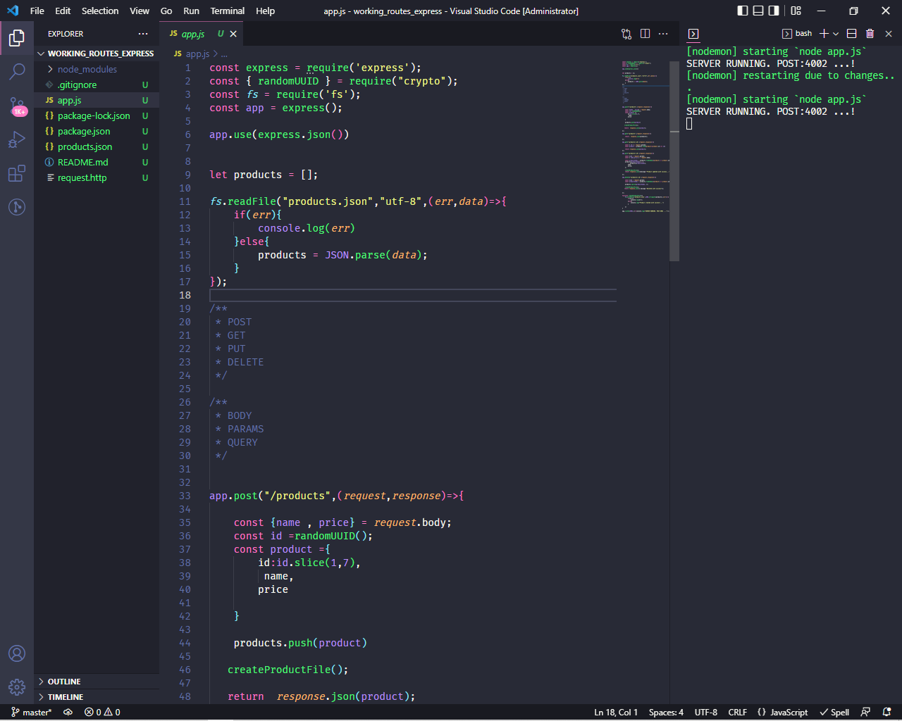

# Working with routes  in express.js
## Olá Mundo!😉👋

Começei a estudar o express.js e achei fantastico e resolve compartilhar alguns conceitos 
e exmplos que estou a aprender, por esse motivo postarei sempre conteudos referentes a esse framework

## What is express.js
Express framework – Express is a minimal and flexible Node js web application
framework that provides a robust set of features for the web and mobile applications.

## What are Routes
Routing refers for determining the way in which an application responds to a client request to
a particular endpoint. 
For example, a client can make a GET, POST, PUT or DELETE http request for various URL's
such as the one's shown below;

<pre>http://localhost:3000/products 
http://localhost:3000/products/0393</pre>

